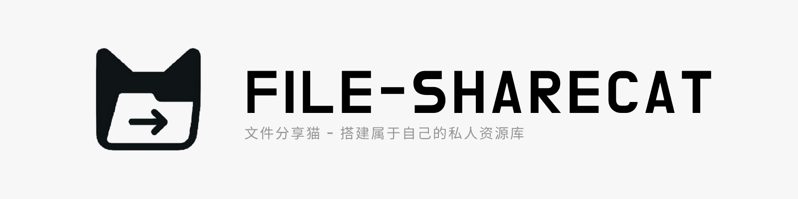

# FILE-SHARECAT

 

     

---

 

## 📑 简介 

这是一个文件分享项目，支持通过公共资源访问和密钥访问私密资源，仅支持管理员上传文件，因此不提供公共登录功能。

- ⚡ **快速部署**：支持 Railway 快速部署，逻辑轻量，适合快速部署和试用。
- 🔐 **私密资源访问**：通过密钥访问私密资源，确保资源安全。
- 🧩 **数据库**：使用 MONGODB 数据库以管理资源文件元数据。
- ☁️ **对象存储**：仅支持 S3 协议的对象存储平台以存储资源。

该项目非常适合用于当作私人资源库，亦可以使用私密资源模块与他人分享，当前已完成全部基础功能，后续将不定期优化和迭代。

 

[点击查看部署教程](./docs/DEPLOY.md)

 

## 📫 TODO:

- [ ] API接口文档
- [ ] 仅私密资源模块开关
- [ ] 管理员登录日志
- [ ] 支持更多协议的对象存储